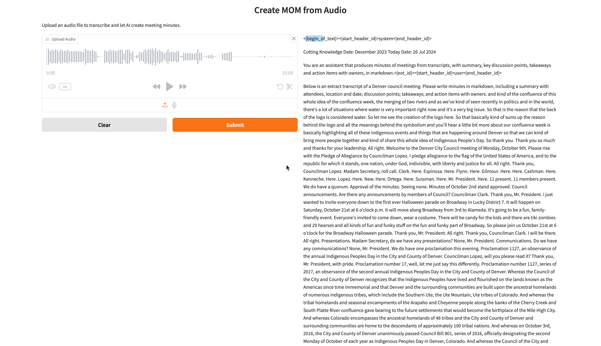

# Project Title: Generative AI & LLM Catalyst: Hands-On Innovation 

A collection of Jupyter notebooks demonstrating how to **summarize webpages** and create a **tech Q&A chatbot** using both **OpenAI** and **Ollama** (local LLM) and implement **RAG (Retrieval-Augmented Generation)** using both **OpenAI** and **Ollama (local LLMs)**.

---

## Table of Contents

1. [Introduction](#introduction)  
2. [Project Structure](#project-structure)  
3. [Features](#features)  
4. [Getting Started](#getting-started)  
   - [Prerequisites](#prerequisites)  
   - [Installation](#installation)  
5. [Usage](#usage)  
   - [1. Webpage Summarization](#1-webpage-summarization)  
   - [2. Tech Q&A Chatbot](#2-tech-qa-chatbot)  
   - [3. Meeting Minutes Generator](#3-meeting-minutes-generator)  
   - [4. RAG Approaches](#4-rag-approaches)  
6. [Notebook Details](#notebook-details)  
7. [Troubleshooting](#troubleshooting)  
8. [Contributing](#contributing)  
9. [License](#license)  
10. [Contact](#contact)

---

## Introduction

This repository showcases **multiple approaches** to leveraging Large Language Models (LLMs) for:

- Summarizing text from webpages
- Answering technical questions in a chatbot-like interface
- Implementing Retrieval-Augmented Generation (RAG) pipelines using different vector databases

You can choose between **OpenAI** (using their API) or **Ollama** (running a local LLM, like LLaMA or other models) depending on your needs and constraints.

---

## Project Structure

├── RAG  
├  ├── knowledge-base  
├  ├── data  
├  ├── vector_db  
├  ├── brute_force_rag.ipynb  
├  ├── rag_chroma.ipynb  
├  ├── rag_faiss.ipynb  
├── frontier_aiagents  
├  ├── ollama_summarize_webpage.ipynb  
├  ├── openai_summarize_webpage.ipynb  
├  ├── tech_qna_chatbot.ipynb  
├  ├── meeting_minutes_product.ipynb  
├  ├── tech_qna_chatbot.ipynb  
├── requirements.txt  
├── image.png  
├── README.md  

---

## Features

- **Webpage Summaries**: Pass a URL or webpage text to the notebooks to get a concise summary.
- **Local LLM (Ollama)**: Summarize text using a locally hosted LLM if you prefer not to send data externally.
- **OpenAI API**: Summarize text using OpenAI’s GPT models (requires an API key).
- **Tech Q&A Chatbot**: A simple interface that lets you ask technical questions and get answers in real time.
- **Meeting Minutes Generator**: Upload or record audio to generate transcriptions and structured meeting notes.
- **RAG Implementations**:  
	•	`brute_force_rag.ipynb`: Simple document search via cosine similarity.
	•	`rag_chroma.ipynb`: Uses ChromaDB for fast vector-based retrieval.
	•	`rag_faiss.ipynb`: Implements RAG with Facebook’s FAISS for efficient similarity search.

---

## Getting Started

### Prerequisites

- **Python 3.8+** (recommended)
- **Jupyter Notebook** or **JupyterLab** to run `.ipynb` files
- **pip** or **conda** for installing dependencies
- (For OpenAI) An **OpenAI API key** ([Sign up here](https://platform.openai.com/))
- (For Ollama) **Ollama** installed locally if you plan to run the local LLM approach. See [Ollama’s repo](https://github.com/jmorganca/ollama) for setup instructions.

### Installation

1. **Clone this repository**:
   ```bash
   git clone https://github.com/virensasalu/Generative-AI-LLM-Catalyst-Hands-On-Innovation-.git
   cd Generative-AI-LLM-Catalyst-Hands-On-Innovation-
2. **Install Requirement**
   ```bash
   pip install -r requirements.txt
3. **Or Create Conda Environment**
   ```bash
   conda env create -f environment.yml
   conda activate <env-name>
4. **SetUp OpenAI API Key as environment variable**
   ```bash
   export OPENAI_API_KEY="your-openai-api-key"

### Gardio UI for Question and Answers AI-Agent





## Usage

### 1. Summarizing with OpenAI
Use `openai_summarize_webpage.ipynb` to generate summaries using GPT models.

### 2. Summarizing with Ollama
Use `ollama_summarize_webpage.ipynb` to summarize webpages locally.

### 3. Tech Q&A Chatbot
Use `tech_qna_chatbot.ipynb` to ask and answer technical questions using OpenAI.

### 4. Meeting Minutes Generator
Use `meeting-minutes_product.ipynb` to upload or record audio and automatically transcribe and structure meeting notes.

### 5. RAG Approaches
- `brute_force_rag.ipynb` – Implements a basic RAG pipeline without vector embeddings  
- `rag_chroma.ipynb` – Uses ChromaDB to store and retrieve embeddings for efficient and scalable document retrieval.  
- `rag_faiss.ipynb` – Leverages Facebook’s FAISS library for high-speed similarity search and dense vector indexing in a RAG setup.  


### Contact
**Author**: Viren Sasalu, Aastha Prasad  
**Email**: virensasalu@gmail.com, 20aasthaprasad@gmail.com  
**GitHub**: @virensasalu, @20mausam  
